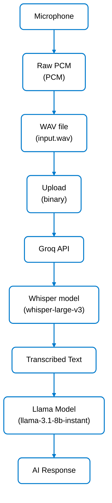

# VOXIS - AI Voice Assistant



*Microphone → Raw PCM Audio → WAV file → Groq API → Whisper Model → Text → Llama Model → AI Response*

Overview

This small project captures raw audio from your microphone, saves it as a WAV file, and sends the audio to Groq's Whisper model for fast speech-to-text (STT).

Files

- `ear.py` — Main script: records audio, saves `input.wav`, and transcribes it via Groq.
- `.env` — Place your `GROQ_API_KEY` here (this file is excluded by `.gitignore`).
- `.gitignore` — Excludes `.env`, `.venv`, `*.wav`, etc.
- `requirements.txt` — Python dependencies.

Quickstart (Windows)

1. Create a virtual environment (recommended):

```powershell
python -m venv .venv
.\.venv\Scripts\Activate.ps1   # PowerShell
# or
.\.venv\Scripts\activate.bat   # cmd.exe
```

2. Install dependencies:

```powershell
python -m pip install -r requirements.txt
```

3. Add your Groq API key to `.env`:

```
GROQ_API_KEY=your_real_api_key_here
```

4. Run the recorder (records 5 seconds by default):

```powershell
python ear.py
```